# Online Cafe

Online Cafe is a full-stack web application developed for a modern café environment. The project combines a React frontend, Spring Boot backend, PostgreSQL database, and an AI-powered chatbot built with FastAPI, Ollama, Semantic Search, and the Model Context Protocol (MCP).

The application allows customers to browse the menu, search and filter products, interact with an intelligent chatbot for recommendations, place orders, while administrators can manage the entire café menu through an administration panel.

---

# Features

## Customer Features

- Browse the complete café menu
- Search menu items
- Filter menu items by category, temperature, caffeine, allergens and sweetness
- User registration and login
- Shopping cart
- Checkout page
- AI-powered chatbot for menu recommendations

## Administrator Features

- Add new menu items
- Edit existing menu items
- Delete menu items
- Manage menu data without directly modifying the database

---

# System Architecture

```
React Frontend
       │
       │ HTTP REST
       ▼
Spring Boot Backend
       │
       ├──────────────► PostgreSQL Database
       │
       ▼
Python FastAPI Chatbot
       │
       ├──────────────► MCP Server
       │                     │
       │                     ▼
       │              PostgreSQL Menu
       │
       ▼
Semantic Search
       │
       ▼
Sentence Transformers
       │
       ▼
Ollama
       │
       ▼
Generated Response
```

---

# AI Chatbot Workflow

The chatbot combines rule-based logic, semantic search, and a local large language model.

The workflow consists of the following steps:

1. The user sends a message through the React frontend.

2. The frontend sends a POST request to the Spring Boot backend.

3. The backend retrieves the complete menu from PostgreSQL.

4. The backend sends both the user message and the menu in JSON format to the Python chatbot.

5. The chatbot first calls the MCP server.

6. MCP retrieves the latest menu directly from PostgreSQL.

7. The chatbot checks a predefined set of rule-based conditions for common requests such as coffee, desserts, cocktails, food, allergens and prices.

8. If a rule matches, an immediate response is returned.

9. If no rule matches, Semantic Search begins.

10. The user message and every menu item are converted into embeddings using Sentence Transformers.

11. Cosine Similarity compares the embeddings and selects the most relevant menu items.

12. The selected menu items are transformed into textual descriptions.

13. These textual descriptions together with the user's question are sent to Ollama.

14. Ollama generates a natural language response.

15. The response is returned through the backend to the React frontend.

---

# Model Context Protocol (MCP)

The chatbot integrates MCP as a tool layer between the language model and the application database.

Instead of relying only on the menu received from the backend, MCP retrieves the latest menu directly from PostgreSQL.

This guarantees that the chatbot always works with the most recent data.

If MCP is unavailable, the chatbot automatically falls back to the JSON menu received from the Spring Boot backend.

---

# Semantic Search

Semantic Search enables the chatbot to understand the meaning of user questions rather than relying only on exact keyword matching.

Each menu item is transformed into a textual description containing:

- Name
- Category
- Temperature
- Sweetness
- Caffeine
- Allergens
- Flavor Profile
- Description
- Price

The user message is converted into an embedding.

Each menu item is also converted into an embedding.

Cosine Similarity is used to measure semantic similarity between the user query and every menu item.

Only the most relevant menu items are forwarded to Ollama for response generation.

---

# Technologies

## Frontend

- React
- TypeScript
- Vite
- CSS

## Backend

- Spring Boot
- Spring Data JPA
- WebClient
- Flyway
- PostgreSQL

## Artificial Intelligence

- Python
- FastAPI
- Ollama
- Sentence Transformers
- Model Context Protocol (MCP)

---

# Database

The PostgreSQL database stores:

- Menu Items
- Prices
- Allergens
- Flavor Profiles
- Orders

Database schema migrations are managed using Flyway.

---

# Project Structure

```
online-cafe/

├── online-cafe-backend/
│
├── online-cafe-frontend/
│
├── python-chatbot/
│
├── pom.xml
│
└── package.json
```

---

# Installation

## Backend

```bash
cd online-cafe-backend
./mvnw spring-boot:run
```

## Frontend

```bash
cd online-cafe-frontend
npm install
npm run dev
```

## Python Chatbot

```bash
cd python-chatbot
pip install -r requirements.txt
uvicorn main:app --reload
```

---

# Application Screenshots

## Home Page

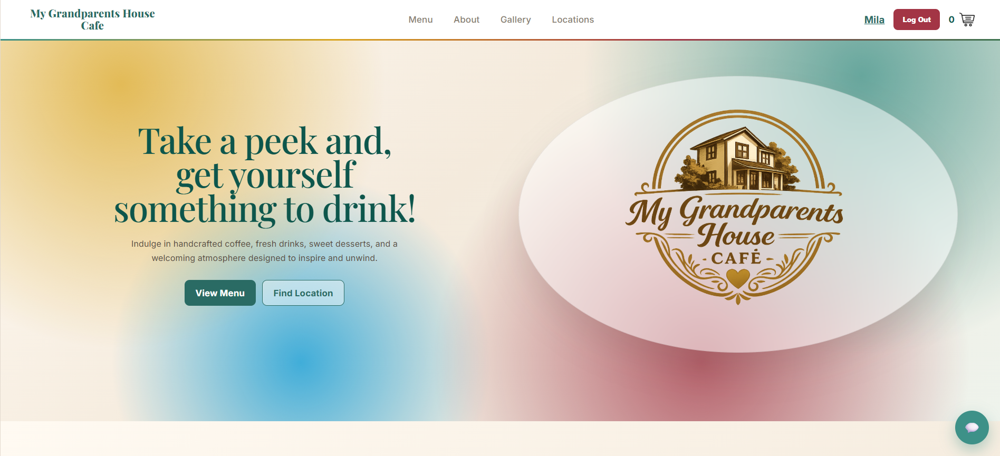

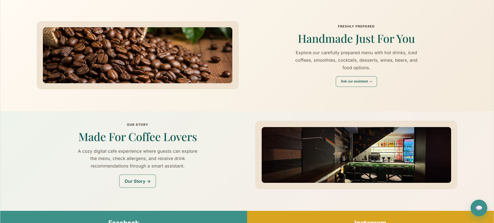

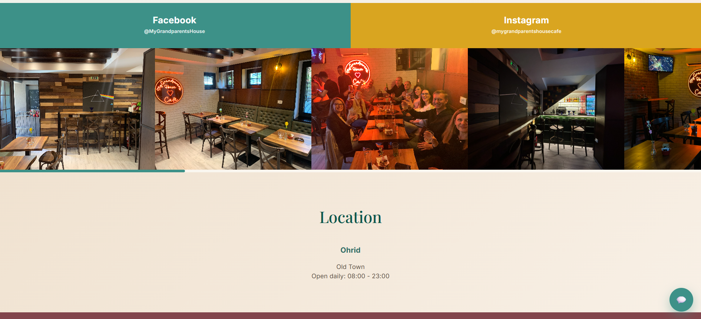

---

## About Page

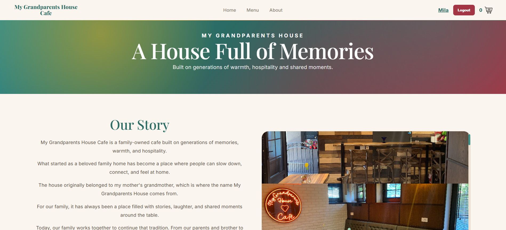

---

## Menu

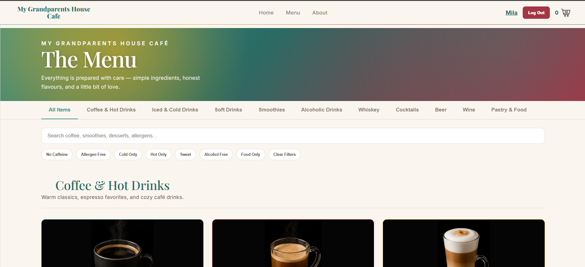

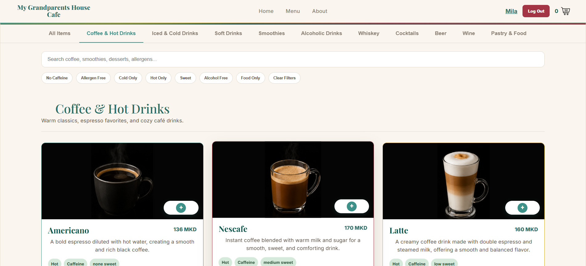

---

## AI Chatbot

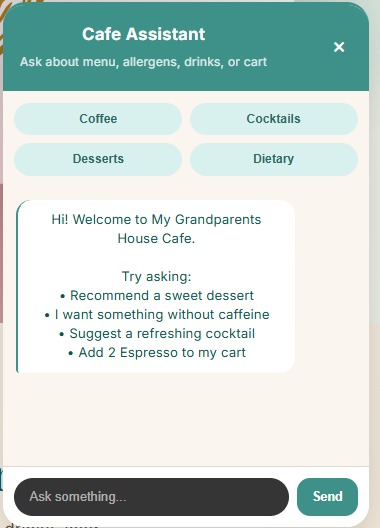

---

## Shopping Cart

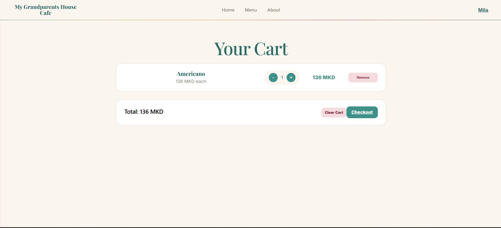

---

## Checkout

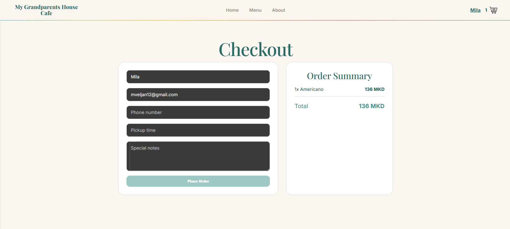

---

## User Profile

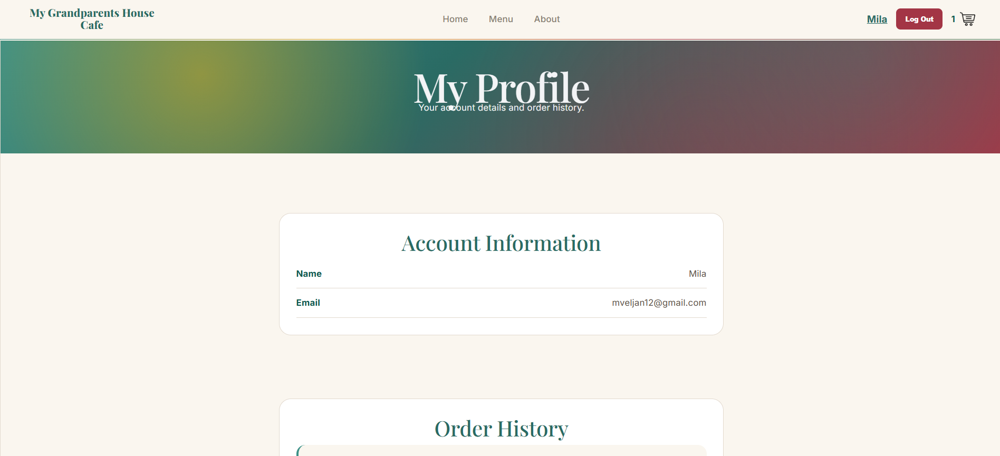

---

## Order History

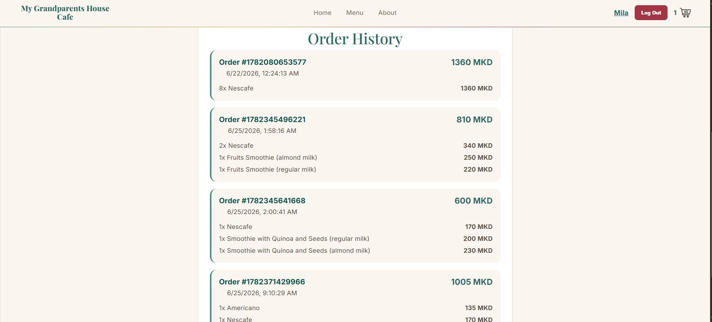

---

## Admin Dashboard

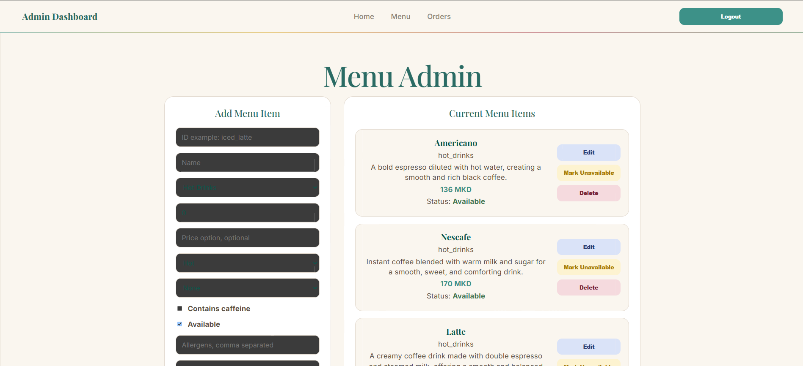

---

## Authentication

### Login

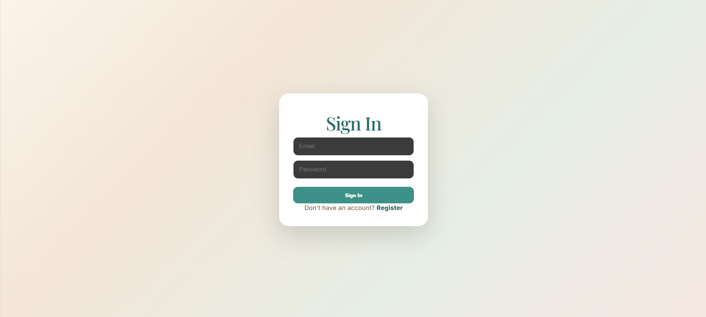

### Register

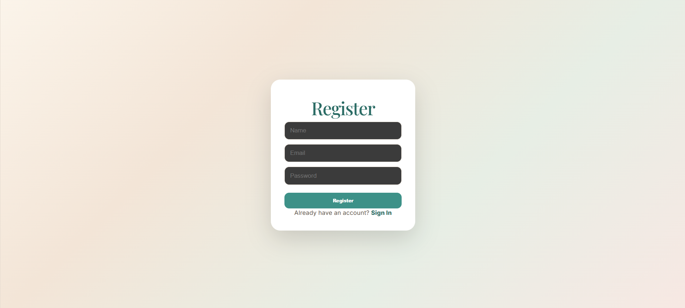


---

# Author

Mila Veljanoska
